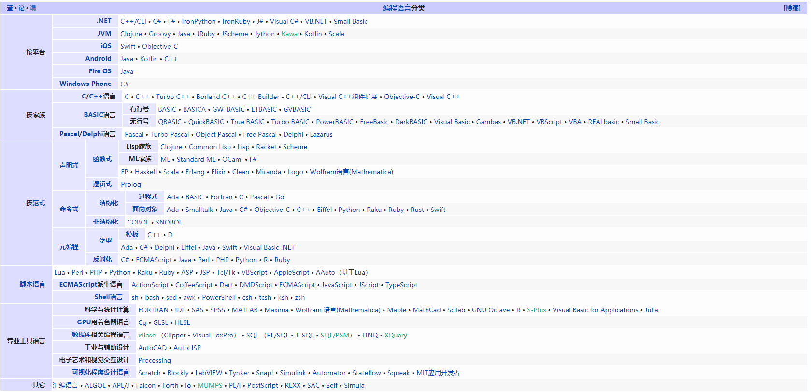

学习笔记

## 四则运算BNF

    <MultiplicativeExpression>::=<Number>|
        <MultiplicativeExpression>"*"<Number>|
        <MultiplicativeExpression>"/"<Number>|
    <AddtiveExpression>::=<MultiplicativeExpression>|
        <AddtiveExpression>"+"<MultiplicativeExpression>|
        <AddtiveExpression>"-"<MultiplicativeExpression>|
    ("("<AddtiveExpression>")")+

## 语言的分类

1、按用途分类-数据描述语言
    
        html、XML、CSS、JSON、JSON5、XAML、SQL、Postscript、PDF、Yaml、Toml、BSON、Pickle、MessagePack、RON、URL、ini、csv

2、按用途分类-编程语言
    
        C、C#、C++、CoffeeScript、Dart、DM、Elixir、Go、Groovy、HTML、Java、JavaScript、Kotlin、Objective-C、Perl、PHP、PowerShell、Python、Ruby、Rust、Scala、Shell、Swift、TypeScript

3、按用表达方式-声明式语言

        JSON、HTML、XAM、SQL、CSS、Lisp、Clojure、Haskell

4、按用表达方式-命令式语言

        C、C++、Java、C#、Python、Ruby、Perl、JavaScript、GO

## [通过javascript进行UTF-8编码](https://www.cnblogs.com/doublenet/p/5616451.html)

## 对象

    面向对象基本特性
    对象
    对象状态
    对象的行为

    设计原则
    对象的行为---改变--->对象的状态

## 找出 JavaScript 标准里面所有具有特殊行为的对象
    1、Array：Array 的 length 属性根据最大的下标自动发生变化。
    2、Object.prototype：作为所有正常对象的默认原型，不能再给它设置原型了。
    3、String：为了支持下标运算，String 的正整数属性访问会去字符串里查找。
    4、Arguments：arguments 的非负整数型下标属性跟对应的变量联动。
    5、模块的 namespace 对象：特殊的地方非常多，跟一般对象完全不一样，尽量只用于 import 吧。
    6、类型数组和数组缓冲区：跟内存块相关联，下标运算比较特殊。
    7、bind 后的 function：跟原来的函数相关联。
    8、Date() 不用new 关键字直接用返回当前时间字符串，用new 关键字返回 时间对象
    9、Reflect与Proxy是相辅相成的，在Proxy上有的方法，在Reflect就一定有
    10、Math 对象并不像 Date 和 String 那样是对象的类，因此没有构造函数 Math()，像 Math.sin() 这样的函数只是函数，不是某个对象的方法。您无需创建它，通过把 Math 作为对象使用就可以调用其所有属性和方法。
    11、RegExp 对象的lastIndex 会变	一个整数，标示开始下一次匹配的字符位置。
    12、Number() 和运算符 new 一起作为构造函数使用时，它返回一个新创建的 Number 对象。如果不用 new 运算符，把 Number() 作为一个函数来调用，它将把自己的参数转换成一个原始的数值，并且返回这个值（如果转换失败，则返回 NaN）
    13、当 String() 和运算符 new 一起作为构造函数使用时，它返回一个新创建的 String 对象，存放的是字符串 s 或 s 的字符串表示。当不用 new 运算符调用 String() 时，它只把 s 转换成原始的字符串，并返回转换后的值。
    14、new Boolean(value);	//构造函数Boolean(value);		//转换函数

## 学习总结

    重学javascript学会了number底层浮点数的设计标准，学会了字符串的底层编码方式，学会了对象的设计原则。
    但是底层原理的东西还还得多花时间学习，现在只是知其一不知其二的状态~
    基础得稳扎稳打，加油