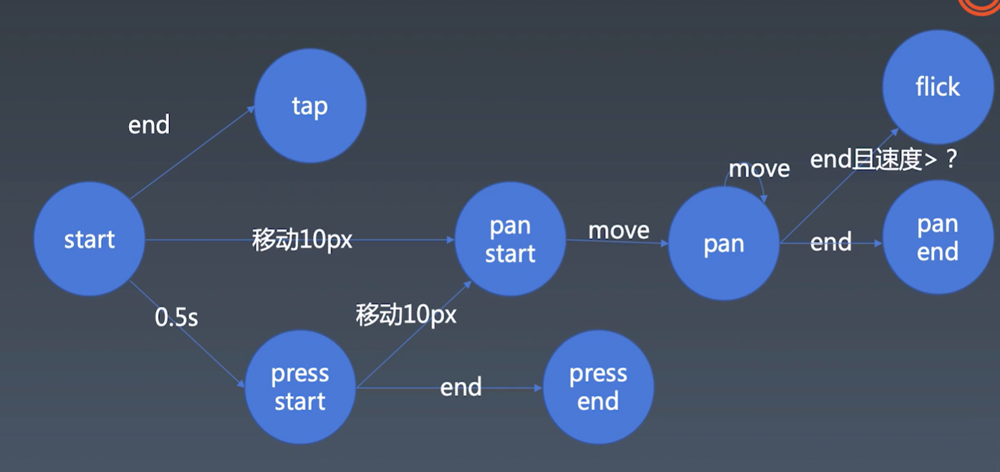

##学习笔记
 
## 动画实现
    class Timeline 负责每一帧的时候生成一个动画状态，然后调用Animation类设置每一帧的状态
        this[TICK] = () => {
            this[TICK_HANDLER] = requestAnimationFrame(this[TICK]);
        }
        this[TICK]();

    class Animation 根据接受的状态值每一个状态设置属性
    
    cancelAnimationFrame(this[TICK_HANDLER])

## cubic-bezier 曲线
https://cubic-bezier.com

## 鼠标的event.button 和 event.buttons

## 手势流程图

## 鼠标禁用右键
    window.document.oncontextmenu = function(){ return false;}

## 10. 手势与动画 | 派发事件

    function dispatch(type, properties) {
        let event = new Event(type);
        for (const key in properties) {
            if (properties.hasOwnProperty(key)) {
                const value = properties[key];
                event[key] = value;
            }
        }
        element.dispatchEvent(event);
    }

    document.documentElement.addEventListener('tap',()=>{
            console.log('tap event trigger')
    })

## 11. 手势与动画 | 实现一个flick事件
    move的时候保存点points，且过滤出500ms内的点，
    计算距离d 当前的点和points的第一个点的距离
    v= d/s
    如果v>1.5则触发flick事件
# 12. 手势与动画 | 封装

    Listener 类负责 鼠标和手指事件监听
    Recognizer 负责识别事件类型
    Dispatcher 负责派发事件

    new Listener(element, new Recognizer(new Dispatcher(element)))
## 本地服务启动

    <script type="module"> import 的时候需要启动服务引入
    
[serve 快速起本地服务](https://github.com/vercel/serve)

## 总结
    学完这一周的课程填补了动画和手势的知识空白，受益匪浅