#学习笔记

## 组件化相关知识

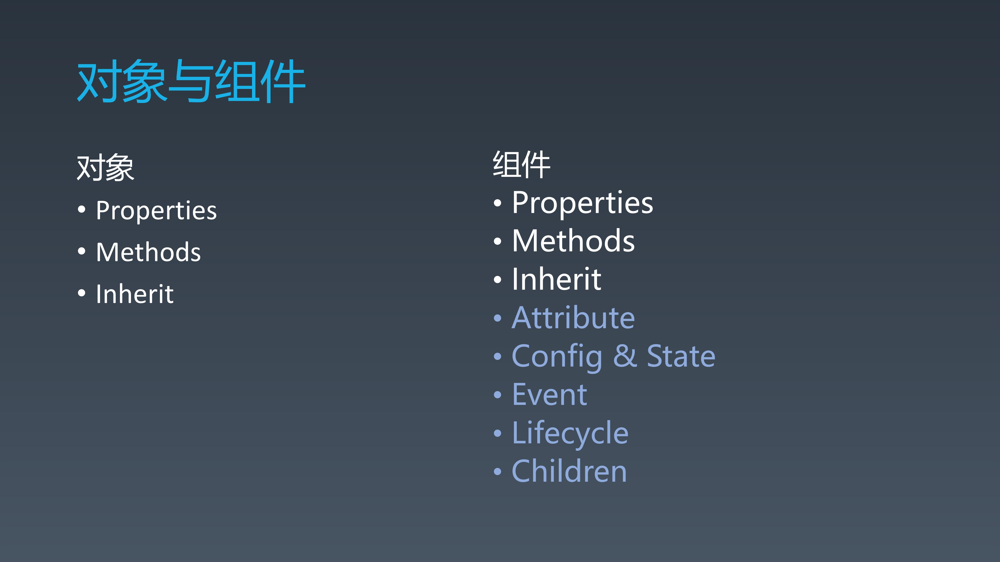

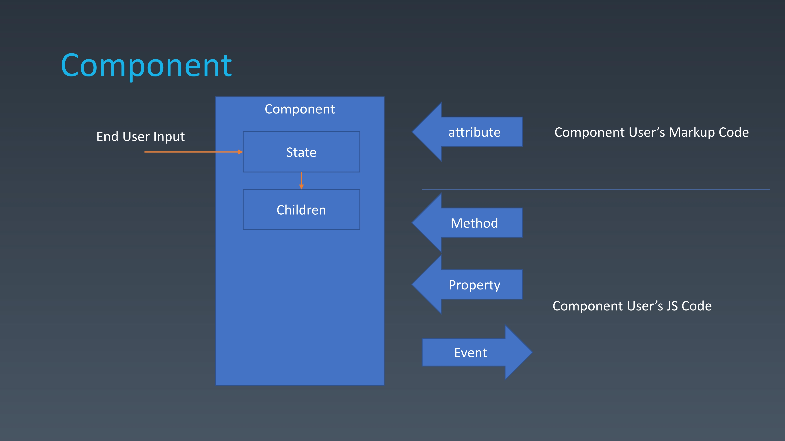

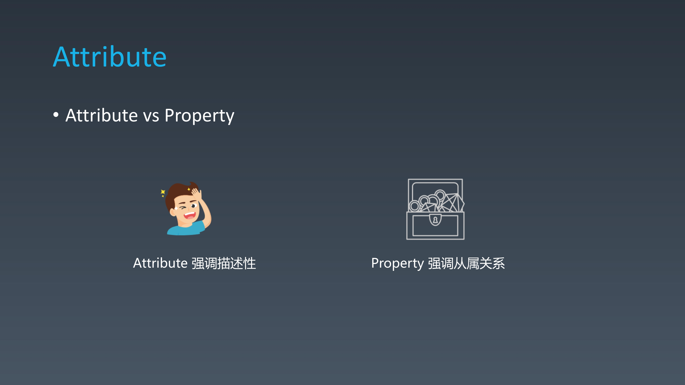

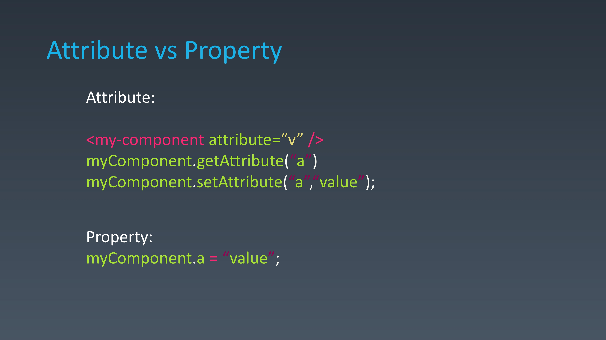

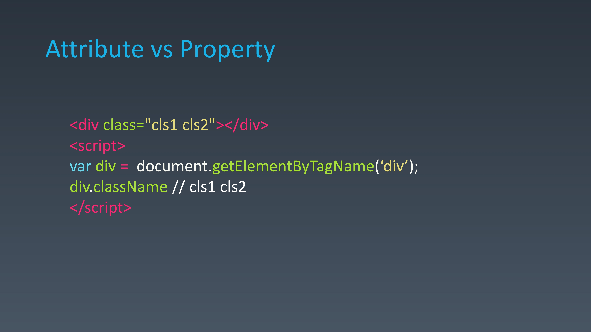

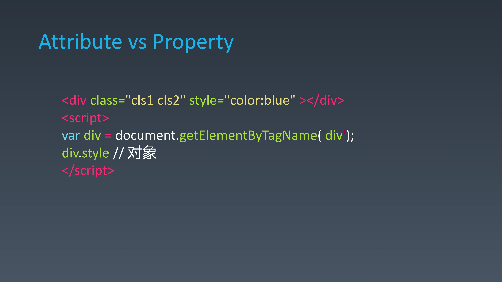

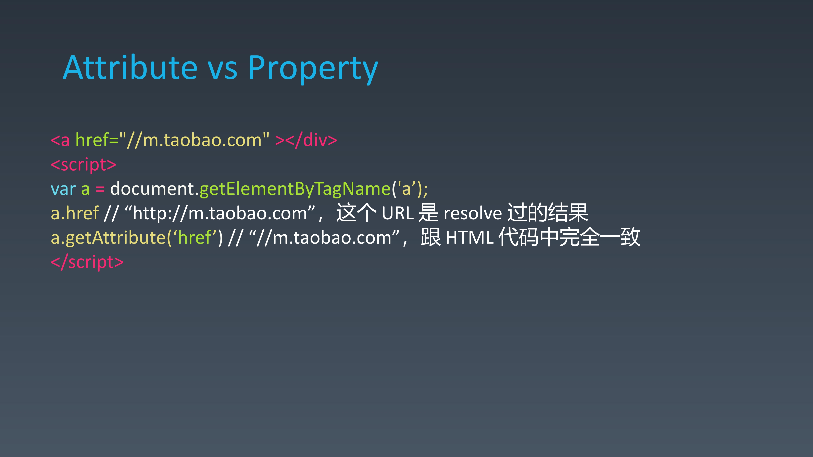

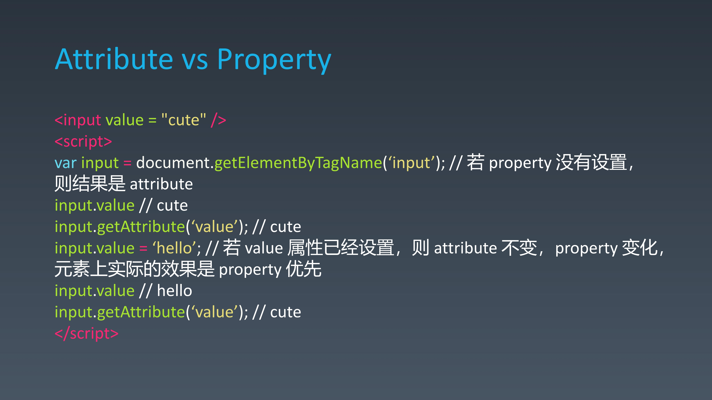

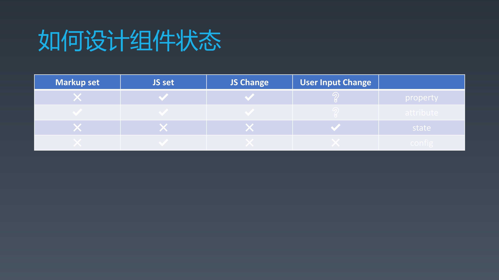

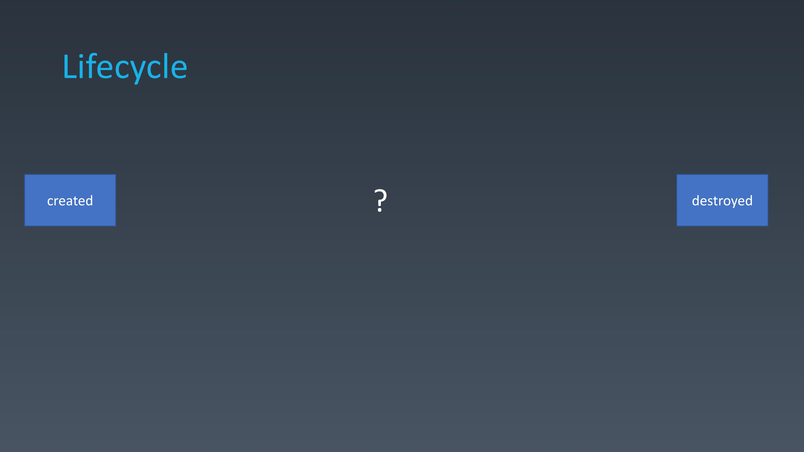

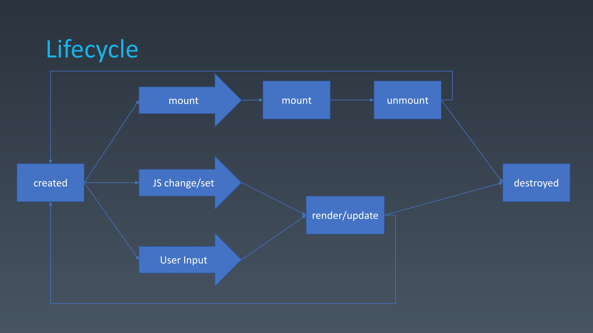

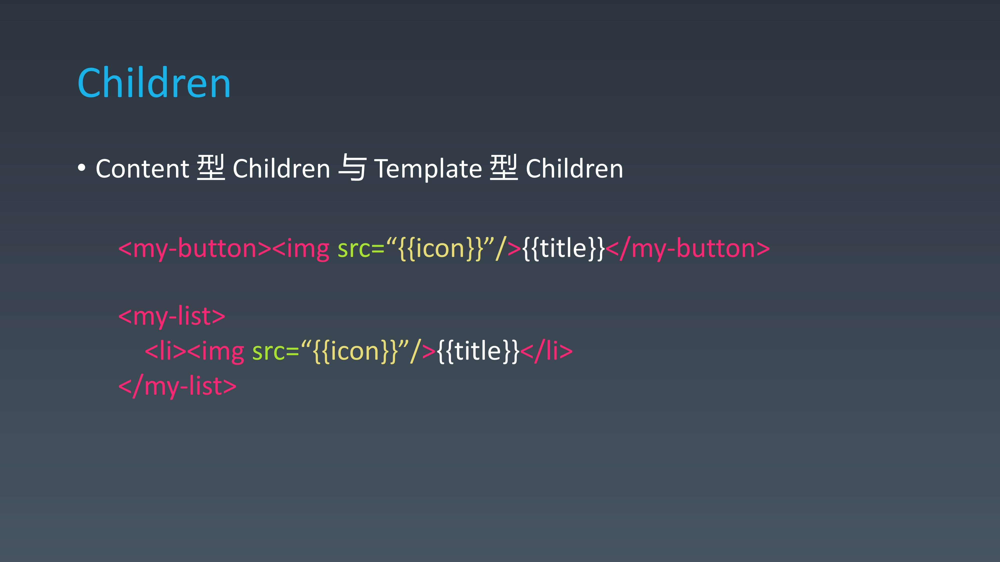

## 动画和手势

### 手势流程图
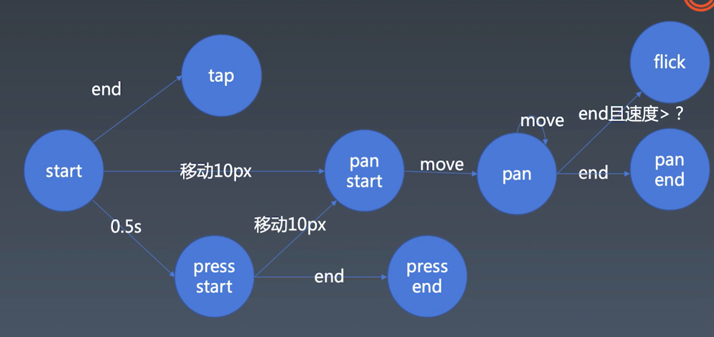

### 动画实现
    class Timeline 负责每一帧的时候生成一个动画状态，然后调用Animation类设置每一帧的状态
        this[TICK] = () => {
            this[TICK_HANDLER] = requestAnimationFrame(this[TICK]);
        }
        this[TICK]();

    class Animation 根据接受的状态值每一个状态设置属性
    
    cancelAnimationFrame(this[TICK_HANDLER])

### 手势与动画-派发事件

    function dispatch(type, properties) {
        let event = new Event(type);
        for (const key in properties) {
            if (properties.hasOwnProperty(key)) {
                const value = properties[key];
                event[key] = value;
            }
        }
        element.dispatchEvent(event);
    }

    document.documentElement.addEventListener('tap',()=>{
            console.log('tap event trigger')
    })

## 总结

组件封装需要按照组件的理论基础站在高点上进行设计，设计过程中需要解耦，将组件中的各个独立功能模块抽离到单独的类或者单独的库，方便公用和解耦。然后再将各个模块进行有机合并，写出更加人性化的组件。其中，每个独立的库内部也要设计得尽量通用，尽可能复用。